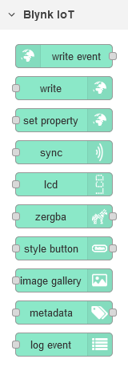
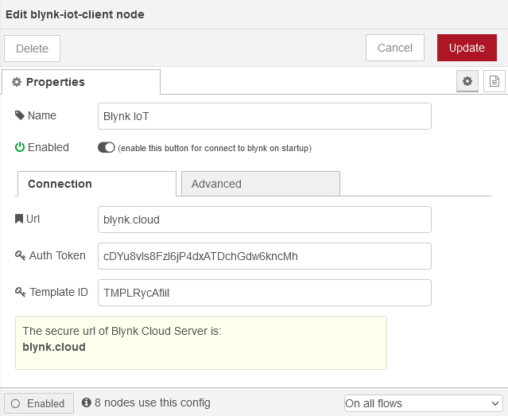
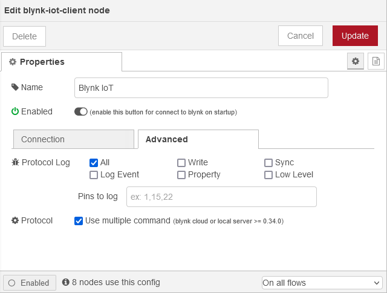

# node-red-contrib-blynk-iot
\
NEW Blynk IoT Platform library implementation for [Node-RED](https://nodered.org/)

[](https://www.npmjs.com/package/node-red-contrib-blynk-iot)
[](https://www.npmjs.com/package/node-red-contrib-blynk-iot)
[](https://github.com/gablau/node-red-contrib-blynk-iot/stargazers)
[](https://github.com/gablau/node-red-contrib-blynk-iot/issues)
[](https://github.com/gablau/node-red-contrib-blynk-iot/blob/master/LICENSE)

[](https://www.npmjs.com/package/node-red-contrib-blynk-iot)

__________

## Node-RED <-> Blynk IoT Platform
This library supports secure TLS connection to new Blynk IoT Platform cloud server.

For Blynk cloud server, you can use **blynk.cloud** as the server url.

**Local server is not yet supported.**

**Do not work on old Blynk 0.1 legacy platform**

If you installed Node Red globally use this command to install
```npm install --global node-red-contrib-blynk-iot```

### Supported events, commands and widgets

**Events:** write\
**Commands:** write, sync (virtual/all), set property, metadata (get/set), log event\
**Widgets:** LCD, zeRGBa, styled button, image gallery

### Changelog

See the [changelog](CHANGELOG.md) for all the details of each releases

### Node-RED palette



### Blynk App Settings

Use Raspberry PI as hardware to access 256 virtual pins or Generic Board for 32.

### How to use

Set your blynk server url, Auth Token  and Template ID in configuration node



See **help** panel on every nodes


### Debug

Use the verbose `-v` flag when starting Node-RED to get more information
or use `node-red-log` and enable log on Configuration Node as needed




### Compatibility

This library is not retrocompatible and cannot replace **node-red-contrib-blynk-ws**.

The new Blynk IoT platform does not allow migration from the old Blynk 0.1 (legacy), so neither does this library.

__________

## Blynk is a unique IoT platform for connecting any hardware to the cloud, designing apps to control them, and managing your deployed products at scale.

- With Blynk Library you can connect **over 400 hardware models** (including ESP8266, ESP32, NodeMCU, all Arduinos, Raspberry Pi, Particle, Texas Instruments, etc.)to the Blynk Cloud.
Full list of supported hardware can be found [here](https://github.com/blynkkk/blynkkk.github.io/blob/master/SupportedHardware.md).

- With Blynk apps for **iOS** and **Android** apps you can easily drag-n-drop graphic interfaces for any DIY or commercial project. It's a pure WYSIWG experience: no coding on iOS or Android required. 

- Hardware can connect to Blynk Cloud (open-source server) over the Internet using hardware connectivity available on your board (like ESP32), or with the use of various shields (Ethernet, WiFi, GSM, LTE, etc). Blynk Cloud is available for every user of Blynk **for free**. Direct connection over Bluetooth is also possible. 


## Downloads

**Blynk [Arduino Library](https://github.com/blynkkk/blynk-library/releases/latest)**

**Blynk Mobile App: 
[ Google Play](https://play.google.com/store/apps/details?id=cloud.blynk) | 
[ App Store](https://apps.apple.com/us/app/blynk-iot/id1559317868)**

## Quickstart: Arduino + Ethernet shield

* Download the Blynk app ([App Store](https://apps.apple.com/us/app/blynk-iot/id1559317868), [Google Play](https://play.google.com/store/apps/details?id=cloud.blynk))
* Get the Auth Token from the app
* Import this library to Arduino IDE. Guide [here](http://arduino.cc/en/guide/libraries)
* In Arduino IDE, select File -> Examples -> Blynk -> Boards_Ethernet -> Arduino_Ethernet
* Update Auth Token in the sketch and upload it to Arduino
* Connect your Arduino with Ethernet shield to the internet

When you are connected - check the included examples on how to use different types of connections (transports) and explore Blynk features. You can combine any example for your hardware + transport + features.

## Supported boards, Ethernet, WiFi, Bluetooth, GSM, Serial, USB...

Full list of supported hardware is [here](https://github.com/blynkkk/blynkkk.github.io/blob/master/SupportedHardware.md).  
Check out our Examples Browser: http://examples.blynk.cc

## Documentation and other helpful links

[Full Blynk Documentation](https://docs.blynk.io) - a complete guide on Blynk features  
[Community (Forum)](http://community.blynk.cc) - join a 500,000 Blynk community to ask questions and share ideas  
[Help Center](http://help.blynk.cc) - helpful articles on various Blynk aspects  
[Code Examples Browser](http://examples.blynk.cc) - browse examples to explore Blynk possibilities  
[Official Website](https://blynk.io)

**Social Media:**

[Facebook](https://www.fb.com/blynkapp) | 
[Twitter](https://twitter.com/blynk_app) | 
[Youtube](https://www.youtube.com/blynk) | 
[Instagram](https://www.instagram.com/blynk.iot/) | 
[LinkedIn](https://www.linkedin.com/company/b-l-y-n-k/)

## Blynk libraries for other platforms
* [Python, MicroPython](https://github.com/blynkkk/lib-python)

## Libraries by community
* [Python, MicroPython](https://github.com/vshymanskyy/blynk-library-python)
* [Particle](https://github.com/vshymanskyy/blynk-library-particle)
* [Lua, OpenWrt, NodeMCU](https://github.com/vshymanskyy/blynk-library-lua)
* [OpenWrt packages](https://github.com/vshymanskyy/blynk-library-openwrt)
* [MBED](https://developer.mbed.org/users/vshymanskyy/code/Blynk/)
* [Node-RED for Blynk IoT](https://flows.nodered.org/node/node-red-contrib-blynk-iot) **This library!** and [for old Blynk](https://www.npmjs.com/package/node-red-contrib-blynk-ws) 


## Attributions

The **node-red-contrib-blynk-iot** was born as a fork of [**node-red-contrib-blynk-ws**](https://github.com/gablau/node-red-contrib-blynk-ws) to support new Blynk IoT Platform

## License
This project is released under The MIT License (MIT)
